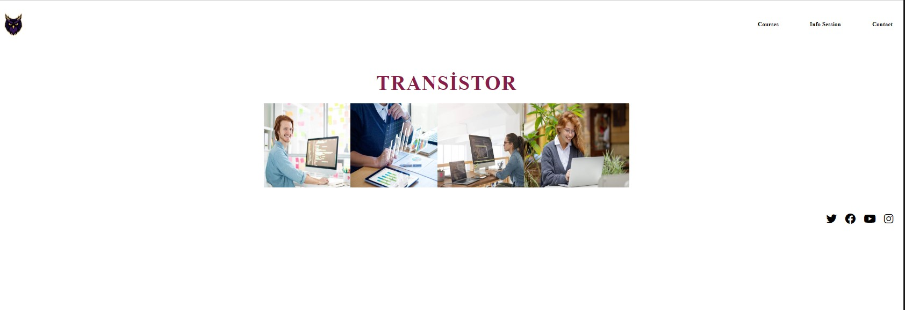

# TRANSİSTOR Website

TRANSİSTOR is a website that showcases various courses and information sessions.

## Screenshots

## Live Link

[Live Demo](https://animation-pearl.vercel.app/) *(Insert your actual live link)*

## Technologies Used

- HTML5
- CSS3
- Font Awesome (for icons)

## Features

- Clean and elegant design showcasing courses, information sessions, and contact details
- User-friendly interface enriched with icons
- Mobile-responsive design

## How to Use

1. Clone this repository to your local machine.
2. Open the `index.html` file in your browser.
3. Customize the content and styling as per your requirements.
4. Optionally, upload the website to a hosting service.

## Contribution

Contributions are welcome! If you'd like to enhance this template or fix any issues, feel free to fork the repository and submit a pull request with your changes.

## License

This project is licensed under the [MIT License](LICENSE).

